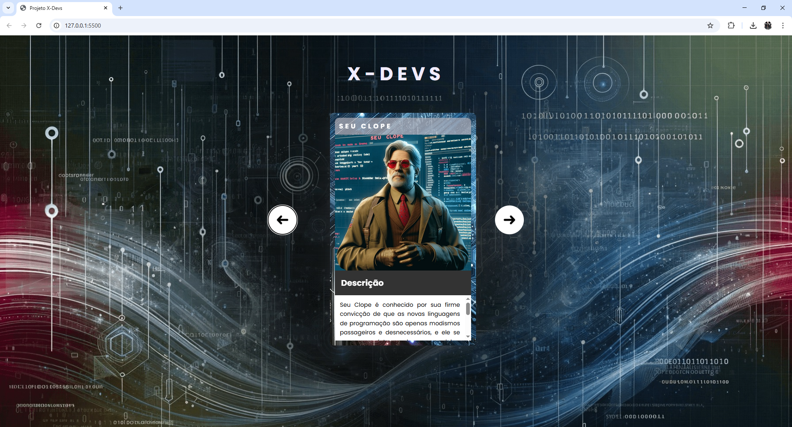

# 💻 X-Devs

Projeto de portfólio para exibir e centralizar meus principais trabalhos e experiências na área de desenvolvimento web.

## 📌 Sobre o projeto

Este site foi desenvolvido com foco em apresentar meus projetos, habilidades e trajetória como desenvolvedor. Ele será atualizado frequentemente com novos projetos e melhorias.

## 🚀 Tecnologias utilizadas

- HTML5
- CSS3
- JavaScript 
- Git & GitHub Pages

## 🌐 Acesse o site

👉 [https://lsenaaquino.github.io/xdevs](https://lsenaaquino.github.io/xdevs)

## 📸 Imagem do projeto

## 🧠 Objetivo

Desenvolver uma base para meu portfólio e, futuramente, integrar novos projetos com frontend e backend.

## 🛠️ Próximos passos

- [x] Subir estrutura básica
- [ ] Adicionar responsividade
- [ ] Criar versão em dark mode
- [ ] Integrar outros projetos

## 📫 Contato

Lucas Sena – [linkedin.com/in/lsenaaquino](https://linkedin.com/in/lsenaaquino)
